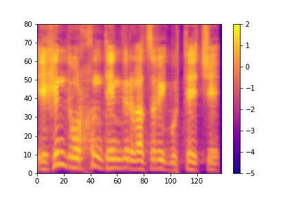

# Speech: 500

### [Challenge](challenge.png)

>While wandering in a foreign country, you overhear a short conversation that contains critical information about an imminent terror attack. A field agent that accompanied you intercepted a single sentence using a malfunctioning device such that only the Spectrogram of the conversation was persisted but not the actual audio file itself. Additionally, the agent who is a polyglot, tells you that he thinks the conversation was in Mongolian. 
>
>Coincidentally, you are a data scientist working in a speech to text (STT) research lab. 
>
>What is being said in the sentence? 
>
>Your task is to reconstruct an audible file from the spectrogram (a numpy array) and reveal what was said. Once you are done, using STT or otherwise, translate the sentence to English. 
>
>**We expect a 10-word sentence in English - NOT in Cyrillic.** 
>
>*Note: the attached image is meant only for illustration purposes; to solve the problem, you should only use the attached binary Spectogram file*
>
>[Speech_image.png](files/Speech_image.png) | [Speech.txt](files/Speech.txt)

### Solution

First, lets reconstruct a spectrogram from the given [numpy array](files/Speech.txt) via the following [script](files/spectrogram_plot.py):

Note: You have to run it with Jupyter (I personally ran it from VS Code with all the necessities installed)
```python
#%%
# ShabakCTF@2021 

import numpy as np
import matplotlib.pyplot as plot
 
# {'descr': '<f4', 'fortran_order': False, 'shape': (138, 80), }
# 
# '<f4' -> '<' = Little endian, 'f4' = float32  (8x4) --> Little Endian 32 bit float
# 'fortran_order' -> False -> don't care
# 'shape': (138, 80) -> 138 dimensions, each dimension has 80 elements


# Remove the header inside "Speech.txt" as np.fromfile doesn't have 'skip_rows' or something in the likes
data = np.fromfile("Speech_without_header.txt", dtype='<f4').reshape(138,80)

# 'plasma' is the colormap that is seen in the question's image, see also these colormaps: https://matplotlib.org/examples/color/colormaps_reference.html
# setting origin='lowest' has the same effect than replacing np.transpose(Z) by np.transpose(Z)[::-1,]
# vmin, vmax give the scale. After briefly looking at the data we can understand that the limits are -5/2db
# extent gives the limits of the x-axis (here 0 to 138 units) and y-axis (0 to 80 units) (in this example I'm plotting the spectrogram of 138 dimensions with each dimension having 80 elements)
# if aspect='auto' is not set, the plot would be very thin and very high
# 
# Source: https://stackoverflow.com/questions/20069545/2d-plot-of-a-matrix-with-colors-like-in-a-spectrogram

plot.imshow(np.transpose(data), extent=[0,138,0,80], cmap='plasma',
           vmin=-5, vmax=2, origin='lowest', aspect='auto')
plot.colorbar()
plot.savefig("spectrogram_matplotlib.png", dpi=2000)
plot.show()

exit()

# %%
```
We get the following image:


We can see that its very similar, if not the same, to the [Speech_image.png](files/Speech_image.png) file. So Im going to use the given [Speech_image.png](files/Speech_image.png) from now on just because it has the correct scale (where as in my image I guessed the scale from reading the numpy array briefly).

After doing some short research on how to extract audio from a spectrogram I came to the following program: [Photosounder](https://photosounder.com/)

It basically synthesizes audio from images and the spectrogram is an image representation of audio so if we give it a spectrogram image, we get its generalized audio (we cant get the exact audio because we need a lot of missing information like the frequencies it was recorded at and etc)

Everything we need can be done in the free demo version so thats why I went with that program.

So, after opening Photosounder, we can then import the spectrogram (after [cropping](files/spectrogram_cropped.jpg) it ofc) and firstly, lower the gamma knob - which is a threshold for the colormap - lowering it to around '7.0:1' should do the trick:

[](files/photosounder_initial_load.png "Click the image to open it in full scale")
<sub><sup>*Click the image to open it in full scale*</sub></sup>

After pressing the play button we can hear something that resembles a monster spawned straight out of the shadow realm:
[**Audio**](files/initial_load_audio.wav)

So that means that we have to guess the correct frequencies in order to get something that resembles a human speaking mongolian.

After some time learning the program and playing with the knobs I gathered that the [following settings](files/photosounder_best_settings.jpg) provide the clearest audio: [**Mongolian Audio**](files/mongolian_audio.aiff)

* Minimum Freq: 6.0 
* Maximum Freq: 8000
* Frequency scale logarithmic base: 1.21
* pixels/seconds (Time resolution): 363
* Gamma: 6.9 <sub><sup><sup>nice</sub></sup></sup>

Now, all we have to do is to [speech recognize it!](files/mongolian_tts.py)

```python
# ShabakCTF@2021 

import speech_recognition as sr
import os

dirname = os.path.dirname(__file__)
filename = os.path.join(dirname, './mongolian_audio.aiff')

harvard = sr.AudioFile(filename)
r = sr.Recognizer()

with harvard as source:
    audio = r.record(source)
    # print(audio)
    # 'mn' stands for Mongolian:
    response = r.recognize_google(audio, language='mn', show_all=True)

print(response['alternative'][0]['transcript'])

# Unfortunately, implemanting a translator was too much work so just paste in google translate :)
```


Pasting the following text into google translate should be easy peasy!

> эхэнд бурхан тэнгэр газрыг бүтээжээ


As the challenge said, we got a 10 word sentence.

Unfortunately, I did 3 tries with the translated text with different formatting. So, before wasting my last attempts, I looked up the phrase really quick and discovered that google translate added a plural "s" on the word "heavens". I should've foreseen the typical google translate errors.. 

### Flag 
>In the beginning God created the heaven and the earth